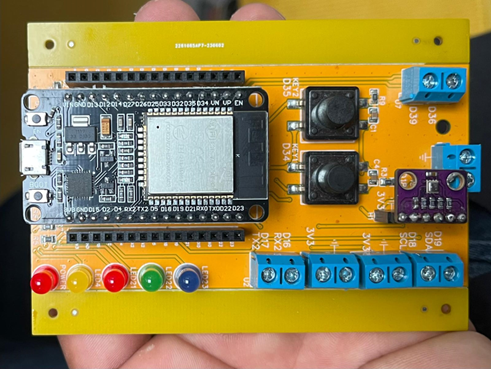

# Embedded Programming - Tutorials

## Objectives

Here you will find a set of tutorials to practice the Embedded Programming concepts using the ESP32 and the Arduino IDE.

This repository is intended to facilitate the understanding of the concepts presented in class, providing step-by-step examples, exercises, and references that students can reproduce and expand upon independently. By following the tutorials, you will gradually build the skills necessary to work with embedded systems in a structured and practical way.

This page is available at: [https://github.com/costawess/EmbeddedProgramming-Course/](https://github.com/costawess/EmbeddedProgramming-Course/)

## Content

The content of each tutorial is listed below:

- [Tutorial 1](/tutorials/tutorial1/ReadMe.md) - Setting up the Arduino IDE. Hello World.
- [Tutorial 2](/tutorials/tutorial2/ReadMe.md) - Input and Output.
- [Tutorial 3](/tutorials/tutorial3/ReadMe.md) - UART Communication and Hello World.
- [Tutorial 4](/tutorials/tutorial4/ReadMe.md) - Variables/Data Types.
- [Tutorial 5](/tutorials/tutorial5/ReadMe.md) - Control Flow: The if-else and switch statements.
- [Tutorial 6](/tutorials/tutorial6/ReadMe.md) - Control Flow: The for, while, and do-while loop statements.
- [Tutorial 7](/tutorials/tutorial7/ReadMe.md) - Functions.
- [Tutorial 8](/tutorials/tutorial8/ReadMe.md) - Arrays and Strings.
- [Tutorial 9](/tutorials/tutorial9/ReadMe.md) - Pointers.
- [Tutorial 10](/tutorials/tutorial10/ReadMe.md) - Structures.
- [Tutorial 11](/tutorials/tutorial11/ReadMe.md) - Libraries.
- [Tutorial 12](/tutorials/tutorial12/ReadMe.md) - I2C Communication.
- [Tutorial 13](/tutorials/tutorial13/ReadMe.md) - SPI Communication.

## How to use

### Organization
The tutorials are presented in sequence, starting from the simplest concepts and gradually moving to more complex and broader topics.  
Each concept is introduced step by step, followed by clear examples that can be reproduced directly.  
Students are encouraged to modify the provided code and apply it to other small projects, reinforcing understanding and solidifying knowledge through experimentation.

### Compatibility
All code examples have been developed and tested using **Arduino IDE version 2.3.5**.  
The reference hardware used throughout this repository is the **ESP32-WROOM-1** development board.  
While most sketches should work on other ESP32 variants, minor adjustments may be required (e.g., pin mappings).

<!-- ## License
==to be included== -->

## External links

- [ESP32-WROOM-32: Datasheet Version 3.6](https://www.espressif.com/sites/default/files/documentation/esp32-wroom-32_datasheet_en.pdf)
