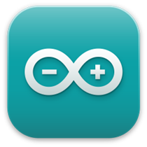
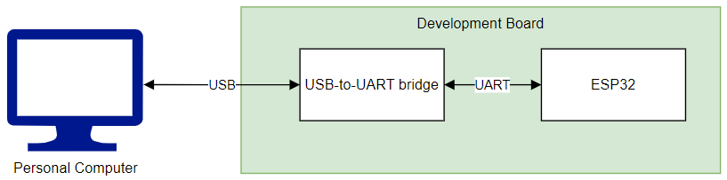
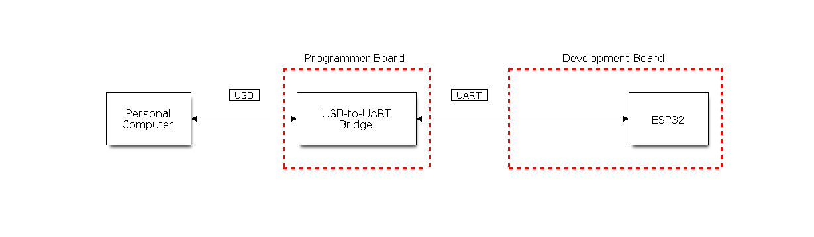
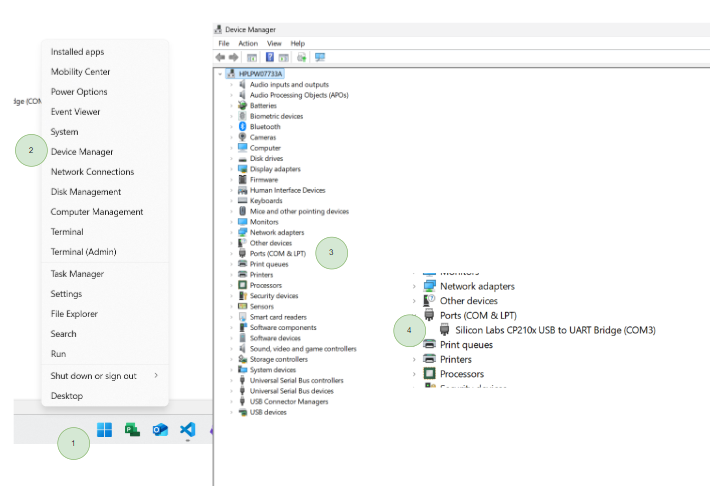
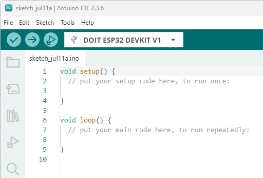
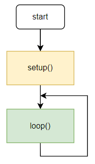
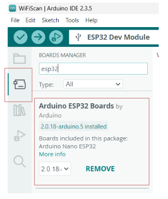
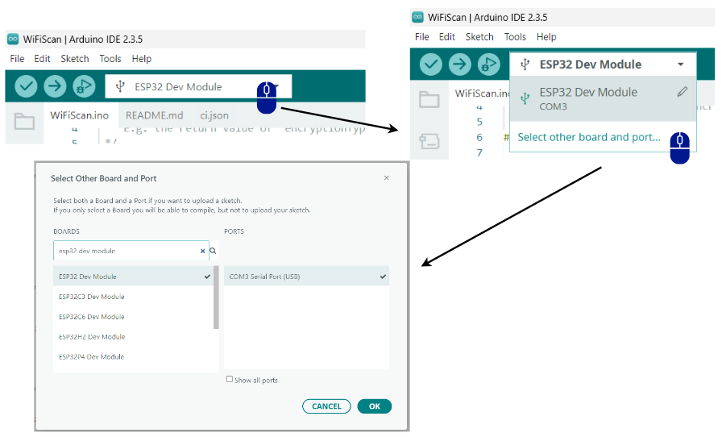
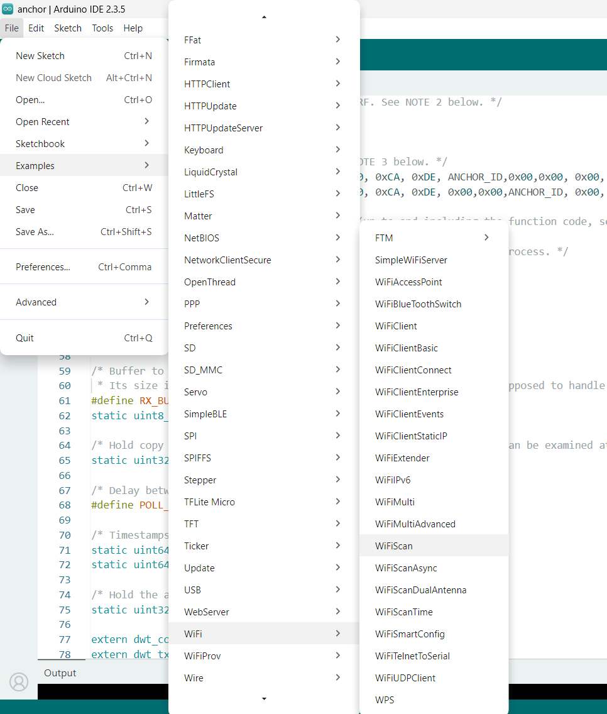
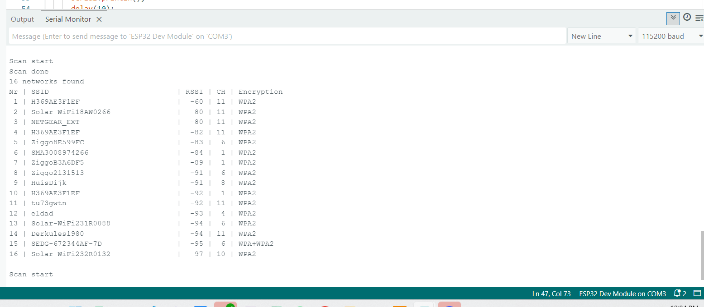

# Tutorial 1 - Setting up the Integrated Development Environment

## What is the Arduino Software (IDE)?



The Arduino Integrated Development Environment—or Arduino Software (IDE)—connects to Arduino/ESP boards to upload software and communicate with them. It brings together in a single graphical interface essential tools for software development, such as a **code editor, compiler, and debugger**.

The programs, also called sketches, are writen in the code editor and save as a `.ino` file.

## Download the IDE

First things first: Download the Arduino IDE on the official website [Arduino.cc](https://www.arduino.cc/en/software/).

## Connect the ESP32 and Install the Driver

To establish a serial connection with your ESP32 device, use a USB-to-UART bridge. This allows your computer to communicate with the ESP32 for programming and debugging.



In some cases, the USB-to-UART bridge is provided as an external module. This approach is common for compact development boards or final products where minimizing space and cost is important.



- The chip enables bidirectional communication (conversion):
    - from the ESP, it converts UART to USB for the PC.
    - from the PC, it converts USB to UART for the ESP.
- So what is the purpose of the driver?
    - it allows the operating system to recognize this chip as a virtual serial port (`COM`).

That is what we will do! ;)

1. First connect the ESP32 to the PC.
2. Download and install the CP210x driver: [CP210x USB to UART Bridge VCP Drivers](https://www.silabs.com/developers/usb-to-uart-bridge-vcp-drivers).
3. Check whether the installation was successful. In the Device Manager, under "Ports," the `Silicon Labs CP210x USB to UART` should appear.



For more details, refer to the [ESP32 Serial Connection Guide](https://docs.espressif.com/projects/esp-idf/en/stable/esp32/get-started/establish-serial-connection.html).


## IDE at First Glance

When you open the IDE for the first time, this sketch window appears.



- `void setup()`: runs only once. Used for initialisations.

- `void loop()`: runs in a loop. Statements are executed infinitely.

In summary, this is the basic structure that every Arduino program follows. The `setup()` function runs once at the start, typically used for initialization, while the `loop()` function contains the main code that runs repeatedly. This structure ensures your program can continuously respond to inputs and perform tasks.

```cpp

// this is a comment

void setup()
{
    //this part will be run just once
}

void loop()
{
    //this part will be executed in a loop
    //(as the name of the function suggests)
}
```

The following flowchart represents the code flow.



## Installing the ESP32 library

Navigate to the Boards Manager, search for `Arduino ESP32 Boards` or `esp32`, and then click `Install`.



If this step did not work, please follow the randomNerdsTutorial approach [link](https://randomnerdtutorials.com/installing-the-esp32-board-in-arduino-ide-windows-instructions/) to install the ESP32 board in the arduino IDE. 

## Selecting the ESP board

To select the board navigate to `Tools > Board > esp32 > ESP32 Dev Module`.


Alternativelly:



## Example 1: Hello World
The codes below show two options for printing "Hello World" via Serial communication. Please open the Serial Monitor in the Arduino IDE to see what is being transmitted.

```cpp
// ESP32 "Hello, world" — v1
void setup() {
  Serial.begin(115200);          // Open serial at 115200 bps
  Serial.println("Hello, world"); 
}

void loop() {
  // Nothing to do here
}
```


```cpp
// ESP32 "Hello, world" — v2
void setup() {
  Serial.begin(115200);
}

void loop() {
  Serial.println("Hello, world");
  delay(1000);
}
```

**Answer:** What is the difference in the behavior of the codes?

- In the first code, "Hello, world" is printed only once, right after the ESP32 starts, because the `Serial.println("Hello, world");` command is inside the `setup()` function, which runs only once.
- In the second code, "Hello, world" is printed repeatedly every second, because the `Serial.println("Hello, world");` command is inside the `loop()` function, which runs continuously. The `delay(1000);` causes a 1-second pause between each print.


## Example 2: Wifi Scan

Let's try a built-in example from the IDE.

First, open the WiFiScan example. Navigate to `File > Examples > WiFi > WiFiScan`.



To open the Serial Monitor, click the magnifying glass icon in the upper right corner of the window.


The ESP will output the Wifi networks found:



<!-- TODO ## What happens in the background? -->

## References

- Using the Arduino Software (IDE)
<https://docs.arduino.cc/learn/starting-guide/the-arduino-software-ide/>
- UART Communication <https://randomnerdtutorials.com/esp32-uart-communication-serial-arduino/>

## Next Tutorial
Go to [Tutorial 2](../tutorial2/ReadMe.md) - Input and Output.

Back to [main page](../../README.md).