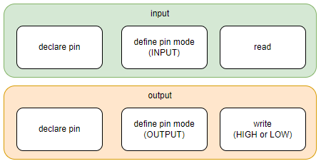

# Tutorial 2 - Input and Output

## Learning Objectives

- Understand the concept of GPIO (General Purpose Input/Output).
- Configure ESP32 digital pins as input and output.
- Write simple programs to control LEDs.
- Read the state of physical buttons and use them to interact with LEDs.
- Develop basic conditional control logic using if/else statements.

## Introduction to GPIOs

### What are digital input and output pins?

- **Digital Output:**  
    A pin configured as output can send a HIGH (3.3V) or LOW (0V) signal. Then powering an LED for instance.
    *Example*: turning an LED on or off.  

- **Digital Input:**  
    A pin configured as input can read external signals as HIGH or LOW.  
    *Example*: checking if a button is pressed.

Important to note that in many microcontrollers, every GPIO is at least digital. Some GPIOs have extra capabilities, such as analog input, PWM, or special functions such as connectivity protocols. For the ESP32-WROOM-32, please refer to the "Pin Definitions" chapter in the [datasheet](https://www.espressif.com/sites/default/files/documentation/esp32-wroom-32_datasheet_en.pdf).

### Basic configuration in code



## Output Examples – LEDs

### Turning a single LED on and off

```cpp
// Turn on an LED using ESP32

// Define the pin where the LED is connected
const int ledPin = 23;

void setup() {
  // Initialize the LED pin as an output
  pinMode(ledPin, OUTPUT);

  // Turn the LED on
  digitalWrite(ledPin, HIGH);
}

void loop() {
  // Nothing else to do in the loop since the LED remains on
}
```

- `const int`: Declares the variable (`ledPin`) as a constant integer.
- `pinMode`: Initializes the pin as `INPUT` or `OUTPUT`. This allows the pin to send/write voltage to the LED (OUTPUT) or to receive/read (INPUT).
- `digitalWrite`: Sets the output of the pin to `HIGH` or `LOW`.

<details>
<summary>Exercise 1</summary>

**Task:**  
Develop a program to light up multiple LEDs.

**Solution:**  
[ex1](ex1/ex1.ino)
</details>

<details>
<summary>Exercise 2</summary>

**Task:**  
Develop a program to light up multiple LEDs. Make them blink in sequence (use the `delay()` function).  

**Solution:**  
[ex2](ex2/ex2.ino)

</details>

## Input Examples – Buttons

```cpp
// Reading the state of a button with ESP32

const int buttonPin = 34;  // GPIO where the button is connected
int buttonState = 0; // state of the button

void setup() {
  // Initialize Serial Monitor
  Serial.begin(115200);

  // Configure the button pin as input
  pinMode(buttonPin, INPUT);
}

void loop() {
  // Read the state of the button
  buttonState = digitalRead(buttonPin);

  // Print the state
  if (buttonState == HIGH) {
    Serial.println("Button is pressed!");
  } else {
    Serial.println("Button is not pressed.");
  }
}
```

<details>
<summary>Exercise 3</summary>

**Task:**  
Develop a program to turn on an LED when the button is pressed.

<!-- **Solution:**  
[ex3](ex3/ex3.ino) -->

</details>

<details>
<summary>Exercise 4</summary>

**Task:**  
Develop a program to turn on an LED combinations: multiple buttons controlling LEDs. Create your own logic.

<!-- **Solution:**  
[ex4](ex4/ex4.ino) -->

</details>

## Next Tutorial

Go to [Tutorial 3](../tutorial3/ReadMe.md) - Input and Output.

Back to [main page](../../README.md).
