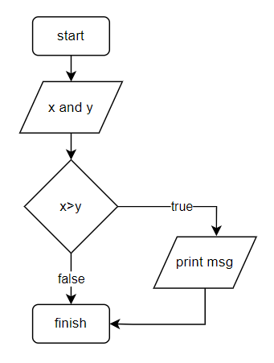
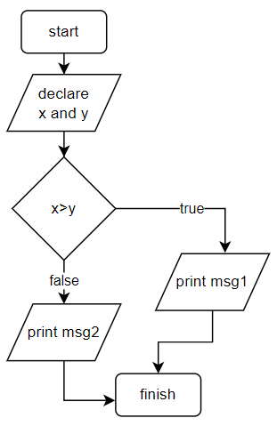
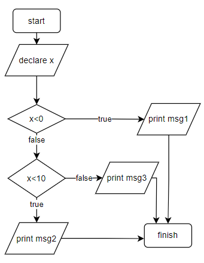
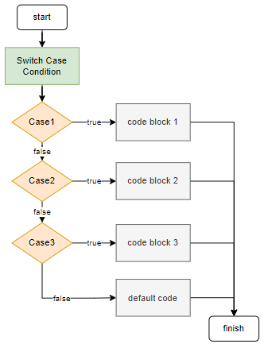
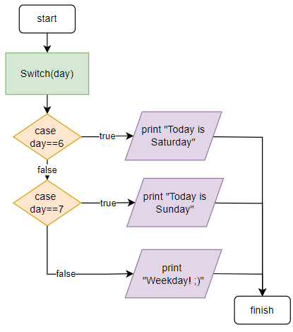

# Tutorial 5 - Control Flow: The if-else and switch statements.


## if statement


```cpp
int x = 10;
int y = 20;
if (x > y) {
  printf("x is greater than y");
}
```



### if-else statement

```cpp
int x = 10;
int y = 20;
if (x > y) {
  printf("x is greater than y");
}
else
{
    printf("x is greater than y");
}
```




### if-else-if statement

```cpp
int x = 10;

if (x < 0) {
  printf("x is less than 0"); // message 1
}
else if (x<10)
{
    printf("x is greater than or equal to 0 and less than 10"); // message 2
}
else
{
    printf("x is greater than or equal to 10"); // message 3
}
```




## The switch statement



### Example: Switch statement


```cpp
int day = 3;

switch (day) {
  case 6:
    printf("Today is Saturday");
    break;
  case 7:
    printf("Today is Sunday");
    break;
  default:
    printf("Weekday! ;)");
}
```



- Obs.: `break` exits the switch. If the command is omitted, the execution falls through into the next case.

## Next Tutorial
Go to [Tutorial 5](../tutorial2/ReadMe.md) - Input and Output.

Back to [main page](../../README.md).